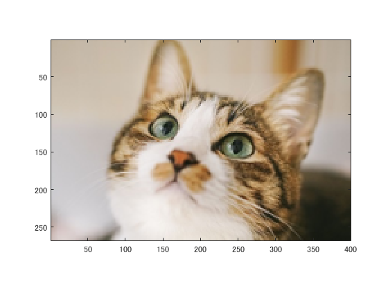
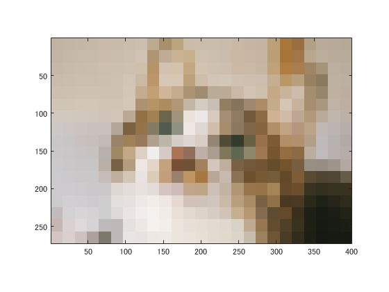
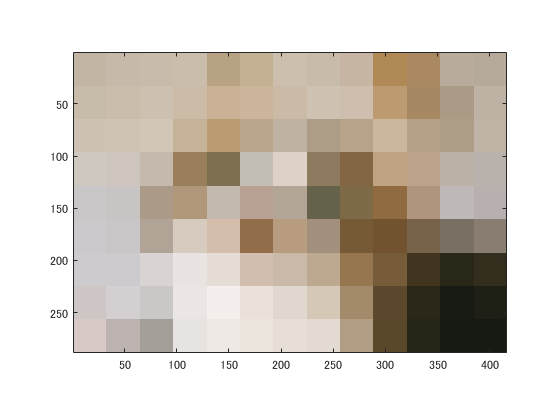

# 課題１レポート

課題内容：画像をダウンサンプリングして（標本化間隔を大きくして）表示せよ．

猫の画像を原画像とする．この画像は縦267画素，横400画素によるディジタルカラー画像である．
````
ORG=imread('kijitora.jpg'); % 原画像の入力  
imagesc(ORG); axis image; % 画像の表示
````
によって，原画像を読み込み，表示した結果を図１に示す．

  
図1 原画像

原画像を1/2サンプリングするには，画像を1/2倍に縮小した後，2倍に拡大すればよい．なお，拡大する際には，単純補間するために「box」オプションを設定する．
````
IMG = imresize(ORG,0.5); % 画像の縮小  
IMG2 = imresize(IMG,2,'box'); % 画像の拡大
````
1/2サンプリングの結果を図２に示す．

  
図2 1/2サンプリング

同様に原画像を1/4サンプリングするには，画像を1/4倍に縮小した後，4倍に拡大すればよい．すなわち，
````
IMG = imresize(ORG,0.5); % 画像の縮小  
IMG2 = imresize(IMG,4,'box'); % 画像の拡大
````
とする．1/4サンプリングの結果を図３に示す．

  
図3 1/4サンプリング

1/8,1/16,1/32サンプリングは，以下のようになる．
````
IMG = imresize(ORG,0.5); % 画像の縮小  
IMG2 = imresize(IMG,8,'box'); % 画像の拡大
````
````
IMG = imresize(ORG,0.5); % 画像の縮小  
IMG2 = imresize(IMG,16,'box'); % 画像の拡大
````
````
IMG = imresize(ORG,0.5); % 画像の縮小  
IMG2 = imresize(IMG,32,'box'); % 画像の拡大
````
サンプリングの結果を図４～６に示す．

  
図4 1/8サンプリング

  
図5 1/16サンプリング

  
図6 1/32サンプリング

このようにサンプリング幅が大きくなると，モザイク状のサンプリング歪みが発生する．
