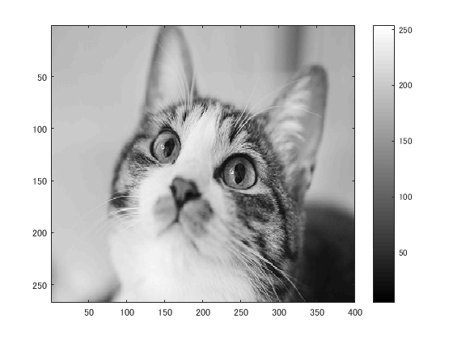
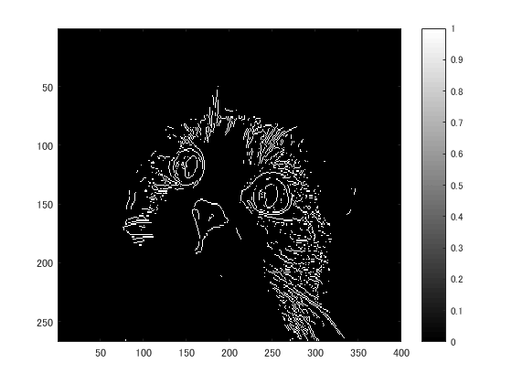
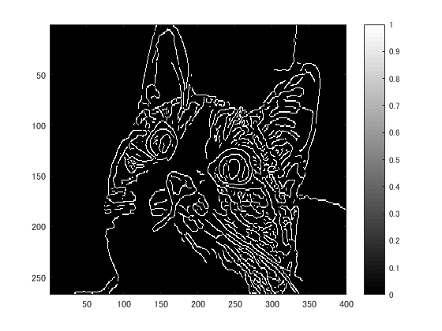

# 課題１０レポート

課題内容：プログラムを参考にして，エッジ抽出を体験せよ．

猫の画像を原画像とする．この画像は縦267画素，横400画素によるディジタルカラー画像である．
````
ORG = imread('kijitora.jpg'); % 原画像の入力
ORG = rgb2gray(ORG); %カラーからグレイへの変換
imagesc(ORG); colormap('gray'); colorbar;% 画像表示
````
によって，原画像を読み込み，グレースケールに変換して表示した結果を図１に示す．

  
図1 グレースケール画像

プレウィット法によりエッジ抽出を行う．
````
IMG = edge(ORG,'prewitt'); % エッジ抽出（プレウィット法）
imagesc(IMG); colormap('gray'); colorbar;% 画像表示
````
結果を図２に示す．

  
図2 プレウィット法によるエッジ抽出

ソベル法によりエッジ抽出を行う．
````
IMG = edge(ORG,'sobel'); % エッジ抽出（ソベル法）
imagesc(IMG); colormap('gray'); colorbar;% 画像表示
````
結果を図３に示す．

  
図3 ソベル法によるエッジ抽出

キャニー法によりエッジ抽出を行う．
````
IMG = edge(ORG,'canny'); % エッジ抽出（キャニー法）
imagesc(IMG); colormap('gray'); colorbar;% 画像表示
````
結果を図４に示す．

  
図4 キャニー法によるエッジ抽出

キャニー法が最も広範囲にエッジを抽出できているとわかる．
