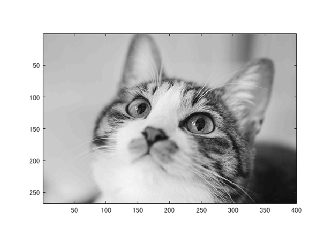
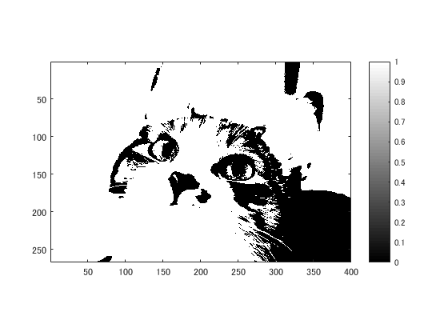
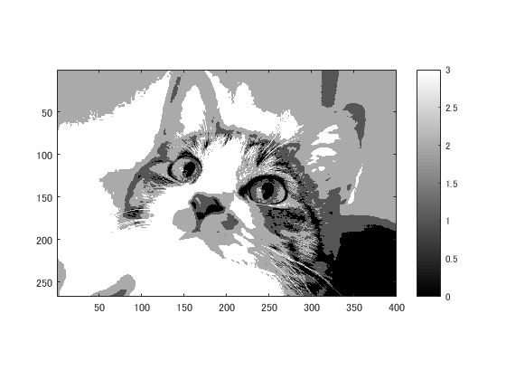
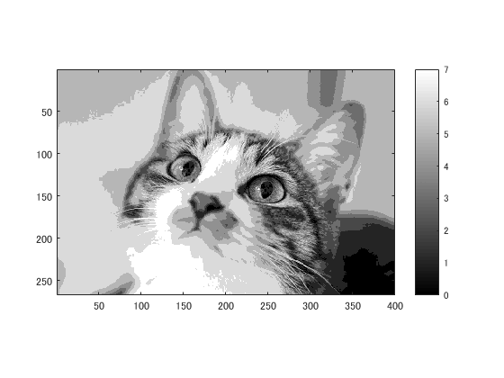

# 課題２レポート

課題内容：２階調，４階調，８階調の画像を生成せよ．

猫の画像を原画像とする．この画像は縦267画素，横400画素によるディジタルカラー画像である．
````
ORG=imread('kijitora.jpg'); % 原画像の入力
ORG = rgb2gray(ORG); colormap(gray); colorbar;
imagesc(ORG); axis image; % 画像の表示
````
によって，原画像を読み込み，グレースケールに変換して表示した結果を図１に示す．

  
図1 グレースケール画像

階調画像は，256を階調数で割った数の倍数を閾値とした画像をまず生成し，それらの和をとることで生成できる．2階調画像は，256/2=128が閾値となる．
````
IMG = ORG>128;
imagesc(IMG); colormap(gray); colorbar;  axis image;
````
2階調画像を表示した結果を図２に示す．

  
図2 2階調画像

同様に4階調画像を生成するには，256/4=64より，64×1=64,64×2=128,64×3=192が閾値となる．これらの和をとると4階調画像となる．
````
IMG0 = ORG>64;
IMG1 = ORG>128;
IMG2 = ORG>192;
IMG = IMG0 + IMG1 + IMG2;
imagesc(IMG); colormap(gray); colorbar;  axis image;
````
4階調画像を表示した結果を図３に示す．

  
図3 4階調画像

8階調画像を生成するには，256/8=32より，32×1=32,32×2=64,32×3=96,32×4=128,32×5=160,32×6=192,32×7=224が閾値となる．これらの和をとると8階調画像となる．
````
IMG0 = ORG>32;
IMG1 = ORG>64;
IMG2 = ORG>96;
IMG3 = ORG>128;
IMG4 = ORG>160;
IMG5 = ORG>192;
IMG6 = ORG>224;
IMG = IMG0 + IMG1 + IMG2 + IMG3 + IMG4 + IMG5 + IMG6;
imagesc(IMG); colormap(gray); colorbar;  axis image;
````
8階調画像を表示した結果を図４に示す．

  
図4 8階調画像

このように階調数が大きくなるほど，元の画像に近づいていくことがわかる．
