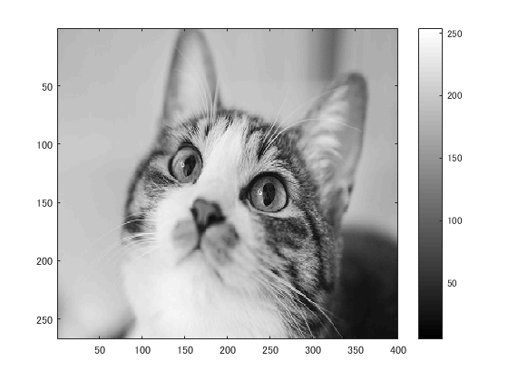
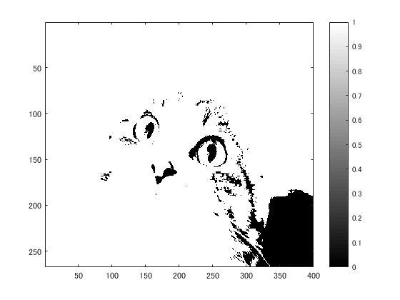
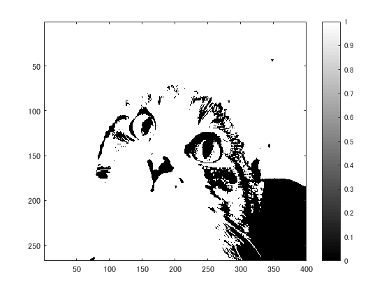
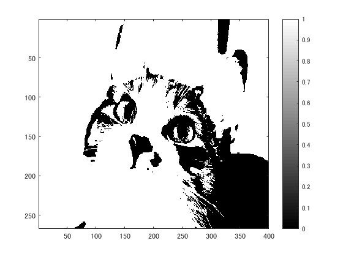
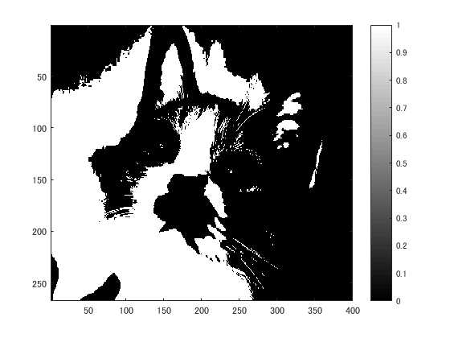

# 課題３レポート

課題内容：閾値を4パターン設定し,閾値処理した画像を示せ．

猫の画像を原画像とする．この画像は縦267画素，横400画素によるディジタルカラー画像である．
````
ORG=imread('kijitora.jpg'); % 原画像の入力
ORG= rgb2gray(ORG); % カラー画像を白黒濃淡画像へ変換
imagesc(ORG); colormap(gray); colorbar; % 画像の表示
````
によって，原画像を読み込み，グレースケールに変換して表示した結果を図１に示す．

  
図1 グレースケール画像

輝度値が64以上の画素を1とし，それ以外を0とすると，輝度値を64として閾値処理した画像を表示できる．
````
IMG = ORG > 64; % 輝度値が64以上の画素を1，その他を0に変換
imagesc(IMG); colormap(gray); colorbar;
````
輝度値が64のときの閾値処理画像を図２に示す．

  
図2 輝度値64のとき

同様に輝度値を96,128,192に設定し閾値処理する．
````
IMG = ORG > 96;
imagesc(IMG); colormap(gray); colorbar;
````
````
IMG = ORG > 128;
imagesc(IMG); colormap(gray); colorbar;
````
````
IMG = ORG > 192;
imagesc(IMG); colormap(gray); colorbar;
````
その結果を図３～５に示す．

  
図3 輝度値96のとき

  
図4 輝度値128のとき

  
図5 輝度値192のとき
