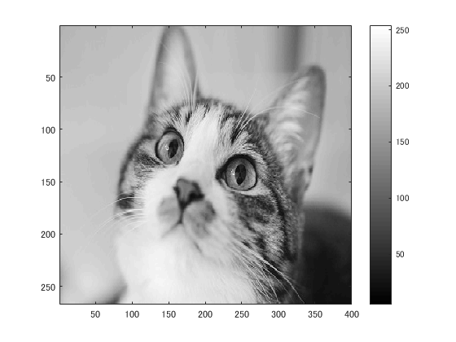
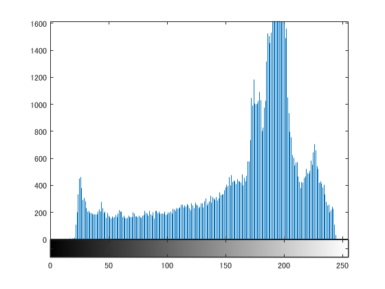

# 課題４レポート

課題内容：画素の濃度ヒストグラムを生成せよ．

猫の画像を原画像とする．この画像は縦267画素，横400画素によるディジタルカラー画像である．
````
ORG=imread('kijitora.jpg'); % 原画像の入力
ORG=rgb2gray(ORG); % カラー画像を白黒濃淡画像へ変換
imagesc(ORG); colormap(gray); colorbar;
````
によって，原画像を読み込み，グレースケールに変換して表示した結果を図１に示す．

  
図1 グレースケール画像

画像のヒストグラムを表示する．
````
imhist(ORG); % ヒストグラムの表示
````
ヒストグラムの結果を図２に示す．

  
図2 ヒストグラム

この結果から，画像の明るい部分の要素がかなり強いことがわかる．
