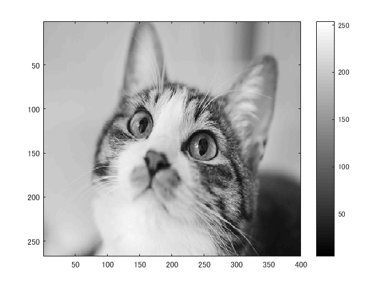
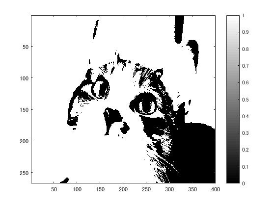
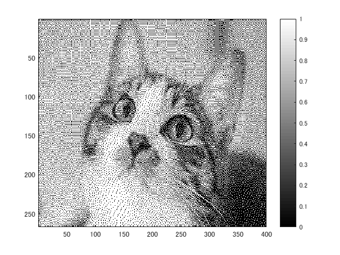

# 課題６レポート

課題内容：サンプルプログラムを用いて画像を二値化せよ．

猫の画像を原画像とする．この画像は縦267画素，横400画素によるディジタルカラー画像である．
````
ORG=imread('kijitora.jpg'); % 原画像の入力
ORG = rgb2gray(ORG);
imagesc(ORG); colormap(gray); colorbar; % 画像の表示
````
によって，原画像を読み込み，グレースケールに変換して表示した結果を図１に示す．

  
図1 グレースケール画像

輝度値が128のときの閾値処理により二値化する．
````
IMG = ORG>128; % 128による二値化
imagesc(IMG); colormap(gray); colorbar; % 画像の表示
````
結果を図２に示す．

  
図2 輝度値128の閾値処理による二値化

また，ディザ法により二値化する．
````
IMG = dither(ORG); % ディザ法による二値化
imagesc(IMG); colormap(gray); colorbar; % 画像の表示
````
結果を図３に示す．

  
図3 ディザ法による二値化
