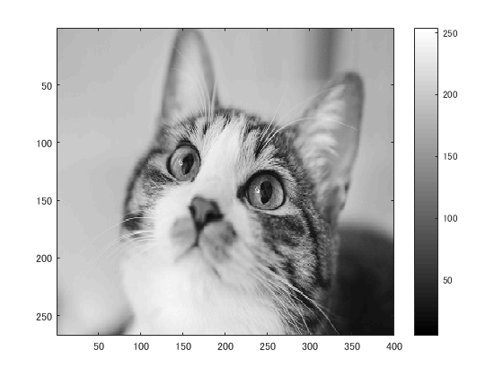
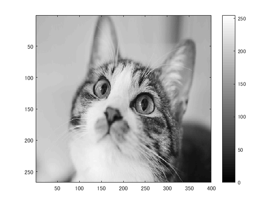
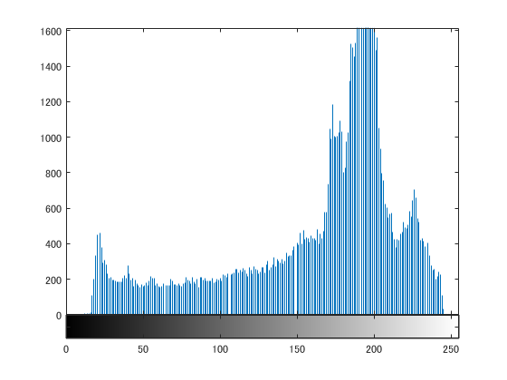

# 課題７レポート

課題内容：画素のダイナミックレンジを０から２５５にせよ．

猫の画像を原画像とする．この画像は縦267画素，横400画素によるディジタルカラー画像である．
````
ORG = imread('kijitora.jpg'); % 画像の読み込み
ORG = rgb2gray(ORG); % 白黒濃淡画像に変換
imagesc(ORG); colormap(gray); colorbar; % 画像の表示
````
によって，原画像を読み込み，グレースケールに変換して表示した結果を図１に示す．

  
図1 グレースケール画像

この時の濃度ヒストグラムを表示する．
````
imhist(ORG); % 濃度ヒストグラムを生成、表示
````
結果を図２に示す．

  
図2 濃度ヒストグラム

ここで，ダイナミックレンジを0から255にし，画像を表示する．
````
ORG = double(ORG);
mn = min(ORG(:)); % 濃度値の最小値を算出
mx = max(ORG(:)); % 濃度値の最大値を算出
ORG = (ORG-mn)/(mx-mn)*255;
imagesc(ORG); colormap(gray); colorbar;
````
結果を図３に示す．

  
図3 ダイナミックレンジ拡大後

この時の濃度ヒストグラムを表示する．
````
ORG = uint8(ORG); % この行について考察せよ
imhist(ORG); % 濃度ヒストグラムを生成、表示
````
結果を図４に示す．

  
図4 ダイナミックレンジ拡大後の濃度ヒストグラム

拡大前のものと比べて少し範囲が広がっていることがわかる．

````
ORG = uint8(ORG); % この行について考察せよ
````

また，この行は，8ビット符号なし整数への変換処理を行っており，ダイナミックレンジの最大値が8ビット符号なし整数の最大値である255であることによるものである．
