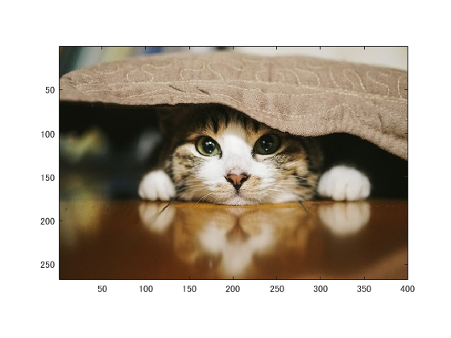
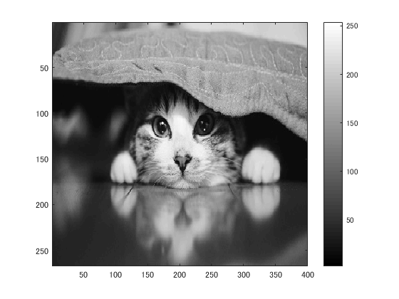
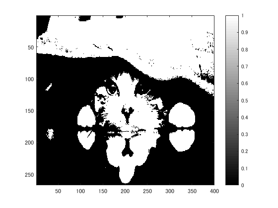
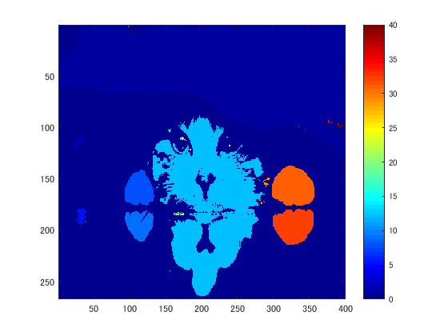

# 課題８レポート

課題内容：二値化された画像の連結成分にラベルをつけよ．

猫の画像を原画像とする．この画像は縦267画素，横400画素によるディジタルカラー画像である．
````
ORG=imread('kijitora2.jpg'); % 原画像の入力  
imagesc(ORG); axis image; % 画像の表示
````
によって，原画像を読み込み，表示した結果を図１に示す．
  
図1 原画像

````
ORG = imread('kijitora2.jpg'); % 画像の読み込み
ORG = rgb2gray(ORG); % 白黒濃淡画像に変換
imagesc(ORG); colormap(gray); colorbar; % 画像の表示
````
によって，原画像を読み込み，グレースケールに変換して表示した結果を図２に示す．

  
図2 グレースケール画像

輝度値128の閾値処理により二値化する．
````
IMG = ORG > 128; % 閾値128で二値化
imagesc(IMG); colormap(gray); colorbar; % 画像の表示
````
結果を図３に示す．

  
図3 輝度値128の閾値処理による二値化

ラベリングをして表示する．
````
IMG = bwlabeln(IMG);
imagesc(IMG); colormap(jet); colorbar; % 画像の表示
````
結果を図４に示す．

  
図4 ラベリング処理後
