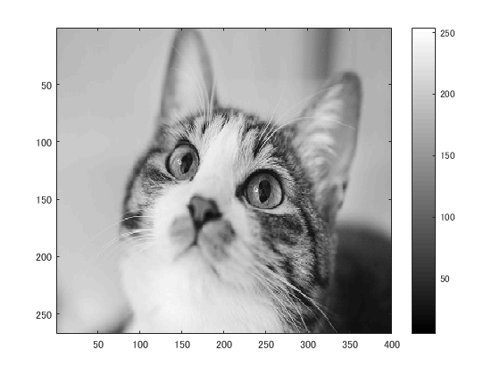
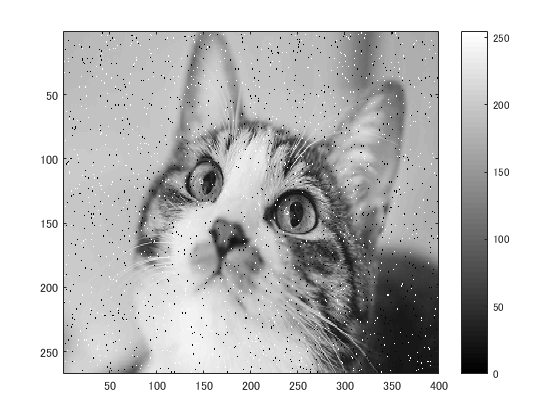
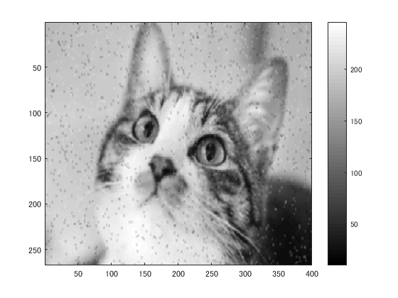
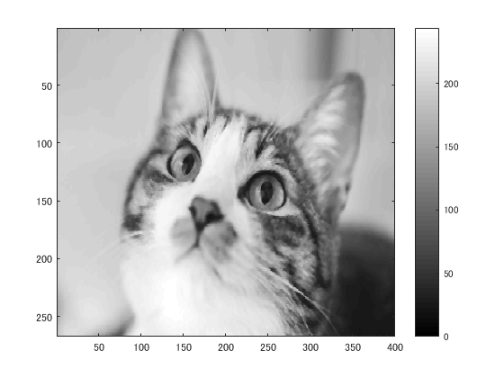
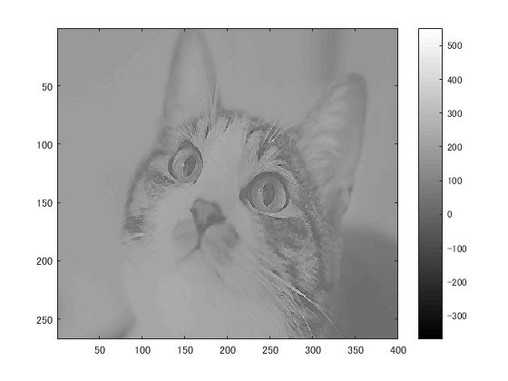

# 課題９レポート

課題内容：メディアンフィルターを適用し，ノイズ除去を体験せよ．

猫の画像を原画像とする．この画像は縦267画素，横400画素によるディジタルカラー画像である．
````
ORG = imread('kijitora.jpg'); % 画像の読み込み
ORG = rgb2gray(ORG); % 白黒濃淡画像に変換
imagesc(ORG); colormap(gray); colorbar; % 画像の表示
````
によって，原画像を読み込み，グレースケールに変換して表示した結果を図１に示す．

  
図1 グレースケール画像

ノイズを添付する．
````
ORG = imnoise(ORG,'salt & pepper',0.02); % ノイズ添付
imagesc(ORG); colormap(gray); colorbar; % 画像の表示
````
結果を図２に示す．

  
図2 ノイズ添付後

平滑化フィルタにより雑音を除去する．
````
IMG = filter2(fspecial('average',3),ORG); % 平滑化フィルタで雑音除去
imagesc(IMG); colormap(gray); colorbar; % 画像の表示
````
結果を図３に示す．

  
図3 平滑化フィルタ処理後

メディアンフィルタにより雑音を除去する．
````
IMG = medfilt2(ORG,[3 3]); % メディアンフィルタで雑音除去
imagesc(IMG); colormap(gray); colorbar; % 画像の表示
````
結果を図４に示す．

  
図4 メディアンフィルタ処理後

メディアンフィルタでの処理後のほうが原画像に近いことがわかる．

また，フィルタ設計をし，適用する．
````
f=[0,-1,0;-1,5,-1;0,-1,0]; % フィルタの設計
IMG = filter2(f,IMG,'same'); % フィルタの適用
imagesc(IMG); colormap(gray); colorbar; % 画像の表示
````
結果を図５に示す．

  
図5 フィルタの設計
